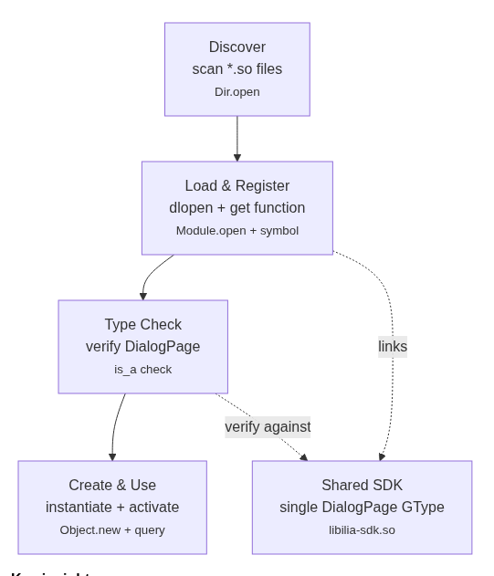

# Ilia Plugin PoC

## Build & Run

```bash
cd poc
meson setup build --reconfigure || meson setup build
meson compile -C build
mkdir -p build/plugins
cp build/greeting-plugin.so build/plugins/
./build/host ./build/plugins
```

## Architecture



**Key insight:**
Both host and plugin link to the same `Ilia.DialogPage` in `libilia-sdk.so` → single GType ID → type checks pass → no segfault

## What it shows

1. **Shared type identity**: host + plugin link same SDK (libilia-sdk.so)
   - Avoids duplicate GType registration crash
2. **Lazy loading**: scan first (cheap), load only when invoked
3. **Type safety**: explicit `is_a()` check before use
4. **Plugin contract**: single exported function `register_ilia_plugin()`

## Files

| File | Purpose |
|---|---|
| sdk.vala | DialogPage interface (shared, linked by both) |
| host.vala | main(), Dir.open(), Module.open(), type check |
| plugin.vala | GreetingPage class, register_ilia_plugin() entrypoint |
| meson.build | libilia-sdk.so (shared), host (binary), greeting-plugin.so (plugin) |

## Expected Output

```
Discovery: found 1 plugin(s) in 0.XX ms
Loaded: ./build/plugins/greeting-plugin.so
Registered type: GreetingPage (hello world) (GType=...) in 0.XX ms
Type check passed: GreetingPage implements DialogPage
GType Verification
Host's  DialogPage GType: ...
Plugin's parent GType:    80
this is how it works (no segfault)
```
